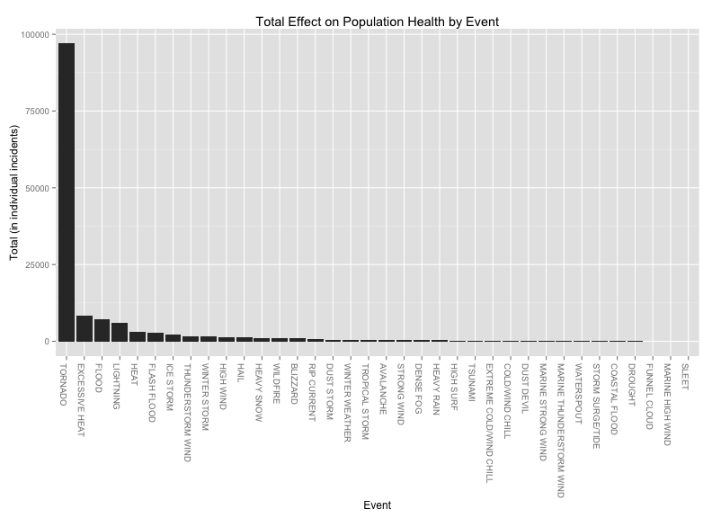
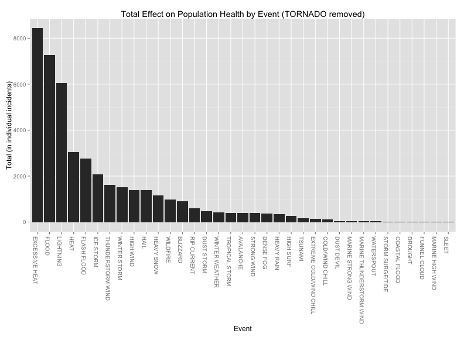
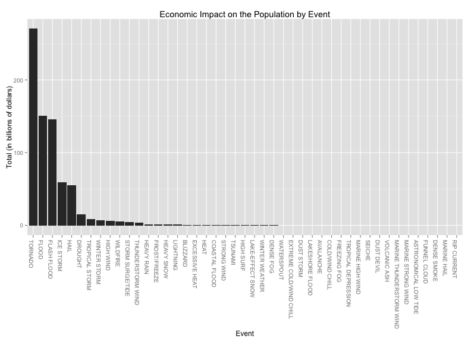

NOAA Storm Data Analysis
========================================================
## Weather Events Effect on the Population

<br>

## Synopsis

Storms and other severe weather events can cause both public health and economic problems for communities and municipalities. Many severe events can result in fatalities, injuries, and property damage, and preventing such outcomes to the extent possible is a key concern.  This analysis will be looking at the effect that weather events have on population health and the economic impact on that population.

The analysis will be addressing two specific questions:

1. Across the United States, which types of events (as indicated in the EVTYPE variable) are most harmful with respect to population health?

2. Across the United States, which types of events have the greatest economic consequences?

<br>

## Data Processing

Before we address the questions, let's take a look at how the data was processed and prepared.

### Required Packages

For this analysis we will be using the <b>ggplot2</b> and <b>dplyr</b> packages


```r
library(ggplot2)
library(dplyr)
```

### The Data

The data for this analysis comes in the form of a comma-separated-value file compressed via the bzip2 algorithm to reduce its size. You can download the file from the course web site:

<span style="padding-left:5em"><a href="https://d396qusza40orc.cloudfront.net/repdata%2Fdata%2FStormData.csv.bz2">Storm Data </a> [47Mb]</span>

There is also some documentation of the database available. Here you will find how some of the variables are constructed/defined.

<span style="padding-left:5em">National Weather Service <a href="https://d396qusza40orc.cloudfront.net/repdata%2Fpeer2_doc%2Fpd01016005curr.pdf">Storm Data Documentation</a></span>

<span style="padding-left:5em">National Climatic Data Center Storm Events <a href="https://d396qusza40orc.cloudfront.net/repdata%2Fpeer2_doc%2FNCDC%20Storm%20Events-FAQ%20Page.pdf">FAQ</a></span>

The events in the database start in the year 1950 and end in November 2011. In the earlier years of the database there are generally fewer events recorded, most likely due to a lack of good records. More recent years should be considered more complete.

### Consume The Data


```r
storm <- read.csv("repdata-data-StormData.csv", header=TRUE)
```

Show some basic information about the data, just to get a feel for it.


```r
names(storm)
```

```
##  [1] "STATE__"    "BGN_DATE"   "BGN_TIME"   "TIME_ZONE"  "COUNTY"    
##  [6] "COUNTYNAME" "STATE"      "EVTYPE"     "BGN_RANGE"  "BGN_AZI"   
## [11] "BGN_LOCATI" "END_DATE"   "END_TIME"   "COUNTY_END" "COUNTYENDN"
## [16] "END_RANGE"  "END_AZI"    "END_LOCATI" "LENGTH"     "WIDTH"     
## [21] "F"          "MAG"        "FATALITIES" "INJURIES"   "PROPDMG"   
## [26] "PROPDMGEXP" "CROPDMG"    "CROPDMGEXP" "WFO"        "STATEOFFIC"
## [31] "ZONENAMES"  "LATITUDE"   "LONGITUDE"  "LATITUDE_E" "LONGITUDE_"
## [36] "REMARKS"    "REFNUM"
```


```r
summary(storm)
```

```
##     STATE__                  BGN_DATE             BGN_TIME     
##  Min.   : 1.0   5/25/2011 0:00:00:  1202   12:00:00 AM: 10163  
##  1st Qu.:19.0   4/27/2011 0:00:00:  1193   06:00:00 PM:  7350  
##  Median :30.0   6/9/2011 0:00:00 :  1030   04:00:00 PM:  7261  
##  Mean   :31.2   5/30/2004 0:00:00:  1016   05:00:00 PM:  6891  
##  3rd Qu.:45.0   4/4/2011 0:00:00 :  1009   12:00:00 PM:  6703  
##  Max.   :95.0   4/2/2006 0:00:00 :   981   03:00:00 PM:  6700  
##                 (Other)          :895866   (Other)    :857229  
##    TIME_ZONE          COUNTY         COUNTYNAME         STATE       
##  CST    :547493   Min.   :  0   JEFFERSON :  7840   TX     : 83728  
##  EST    :245558   1st Qu.: 31   WASHINGTON:  7603   KS     : 53440  
##  MST    : 68390   Median : 75   JACKSON   :  6660   OK     : 46802  
##  PST    : 28302   Mean   :101   FRANKLIN  :  6256   MO     : 35648  
##  AST    :  6360   3rd Qu.:131   LINCOLN   :  5937   IA     : 31069  
##  HST    :  2563   Max.   :873   MADISON   :  5632   NE     : 30271  
##  (Other):  3631                 (Other)   :862369   (Other):621339  
##                EVTYPE         BGN_RANGE       BGN_AZI      
##  HAIL             :288661   Min.   :   0          :547332  
##  TSTM WIND        :219940   1st Qu.:   0   N      : 86752  
##  THUNDERSTORM WIND: 82563   Median :   0   W      : 38446  
##  TORNADO          : 60652   Mean   :   1   S      : 37558  
##  FLASH FLOOD      : 54277   3rd Qu.:   1   E      : 33178  
##  FLOOD            : 25326   Max.   :3749   NW     : 24041  
##  (Other)          :170878                  (Other):134990  
##          BGN_LOCATI                  END_DATE             END_TIME     
##               :287743                    :243411              :238978  
##  COUNTYWIDE   : 19680   4/27/2011 0:00:00:  1214   06:00:00 PM:  9802  
##  Countywide   :   993   5/25/2011 0:00:00:  1196   05:00:00 PM:  8314  
##  SPRINGFIELD  :   843   6/9/2011 0:00:00 :  1021   04:00:00 PM:  8104  
##  SOUTH PORTION:   810   4/4/2011 0:00:00 :  1007   12:00:00 PM:  7483  
##  NORTH PORTION:   784   5/30/2004 0:00:00:   998   11:59:00 PM:  7184  
##  (Other)      :591444   (Other)          :653450   (Other)    :622432  
##    COUNTY_END COUNTYENDN       END_RANGE      END_AZI      
##  Min.   :0    Mode:logical   Min.   :  0          :724837  
##  1st Qu.:0    NA's:902297    1st Qu.:  0   N      : 28082  
##  Median :0                   Median :  0   S      : 22510  
##  Mean   :0                   Mean   :  1   W      : 20119  
##  3rd Qu.:0                   3rd Qu.:  0   E      : 20047  
##  Max.   :0                   Max.   :925   NE     : 14606  
##                                            (Other): 72096  
##            END_LOCATI         LENGTH           WIDTH            F         
##                 :499225   Min.   :   0.0   Min.   :   0   Min.   :0       
##  COUNTYWIDE     : 19731   1st Qu.:   0.0   1st Qu.:   0   1st Qu.:0       
##  SOUTH PORTION  :   833   Median :   0.0   Median :   0   Median :1       
##  NORTH PORTION  :   780   Mean   :   0.2   Mean   :   8   Mean   :1       
##  CENTRAL PORTION:   617   3rd Qu.:   0.0   3rd Qu.:   0   3rd Qu.:1       
##  SPRINGFIELD    :   575   Max.   :2315.0   Max.   :4400   Max.   :5       
##  (Other)        :380536                                   NA's   :843563  
##       MAG          FATALITIES     INJURIES         PROPDMG    
##  Min.   :    0   Min.   :  0   Min.   :   0.0   Min.   :   0  
##  1st Qu.:    0   1st Qu.:  0   1st Qu.:   0.0   1st Qu.:   0  
##  Median :   50   Median :  0   Median :   0.0   Median :   0  
##  Mean   :   47   Mean   :  0   Mean   :   0.2   Mean   :  12  
##  3rd Qu.:   75   3rd Qu.:  0   3rd Qu.:   0.0   3rd Qu.:   0  
##  Max.   :22000   Max.   :583   Max.   :1700.0   Max.   :5000  
##                                                               
##    PROPDMGEXP        CROPDMG        CROPDMGEXP          WFO        
##         :465934   Min.   :  0.0          :618413          :142069  
##  K      :424665   1st Qu.:  0.0   K      :281832   OUN    : 17393  
##  M      : 11330   Median :  0.0   M      :  1994   JAN    : 13889  
##  0      :   216   Mean   :  1.5   k      :    21   LWX    : 13174  
##  B      :    40   3rd Qu.:  0.0   0      :    19   PHI    : 12551  
##  5      :    28   Max.   :990.0   B      :     9   TSA    : 12483  
##  (Other):    84                   (Other):     9   (Other):690738  
##                                STATEOFFIC    
##                                     :248769  
##  TEXAS, North                       : 12193  
##  ARKANSAS, Central and North Central: 11738  
##  IOWA, Central                      : 11345  
##  KANSAS, Southwest                  : 11212  
##  GEORGIA, North and Central         : 11120  
##  (Other)                            :595920  
##                                                                                                                                                                                                     ZONENAMES     
##                                                                                                                                                                                                          :594029  
##                                                                                                                                                                                                          :205988  
##  GREATER RENO / CARSON CITY / M - GREATER RENO / CARSON CITY / M                                                                                                                                         :   639  
##  GREATER LAKE TAHOE AREA - GREATER LAKE TAHOE AREA                                                                                                                                                       :   592  
##  JEFFERSON - JEFFERSON                                                                                                                                                                                   :   303  
##  MADISON - MADISON                                                                                                                                                                                       :   302  
##  (Other)                                                                                                                                                                                                 :100444  
##     LATITUDE      LONGITUDE        LATITUDE_E     LONGITUDE_    
##  Min.   :   0   Min.   :-14451   Min.   :   0   Min.   :-14455  
##  1st Qu.:2802   1st Qu.:  7247   1st Qu.:   0   1st Qu.:     0  
##  Median :3540   Median :  8707   Median :   0   Median :     0  
##  Mean   :2875   Mean   :  6940   Mean   :1452   Mean   :  3509  
##  3rd Qu.:4019   3rd Qu.:  9605   3rd Qu.:3549   3rd Qu.:  8735  
##  Max.   :9706   Max.   : 17124   Max.   :9706   Max.   :106220  
##  NA's   :47                      NA's   :40                     
##                                            REMARKS           REFNUM      
##                                                :287433   Min.   :     1  
##                                                : 24013   1st Qu.:225575  
##  Trees down.\n                                 :  1110   Median :451149  
##  Several trees were blown down.\n              :   568   Mean   :451149  
##  Trees were downed.\n                          :   446   3rd Qu.:676723  
##  Large trees and power lines were blown down.\n:   432   Max.   :902297  
##  (Other)                                       :588295
```

### Clean and Prepare The Data

While complete, the data is very untidy. The first step in tidying the data is normalizing the event types (EVTYPE column). When looking at the event types, we can see that the types are very inconsistent.  Most are all uppercase, but some are lowercase.  Some have leading or trailing white space.  To normalize the event types, we will first apply the uppercase function to the all event type data.  This will help when aggregating the data later on.  We will then apply a trim function to remove leading and trailing white space.


```r
# uppercase the event types to remove some duplicates upon aggregation
storm$EVTYPE <- toupper(storm$EVTYPE)

# create a function that removes leading and trailing whitespace
trim <- function (x) gsub("^\\s+|\\s+$", "", x)

# trim event type of whitespace
storm$EVTYPE <- trim(storm$EVTYPE)
```

After applying these functions, we have a more consistent event type set, but if we run a count on the number of distinct event types we have in the current data set, we will see that we have much more:


```r
length(unique(storm$EVTYPE))
```

```
## [1] 890
```

According to section 2.1.1 of the Storm Data Documentation linked to above, there are 48 distinct event types. We can use the NOAA event type specification to filter down the event types that we care about for this analysis.  Once we do that, we can see that the event types are much more specific and cleaner.


```r
# 48 event types listed in NOAA documentation, uppercased
eventtypes <- c("Astronomical Low Tide","Avalanche","Blizzard","Coastal Flood","Cold/Wind Chill","Debris Flow","Dense Fog","Dense Smoke","Drought","Dust Devil","Dust Storm","Excessive Heat","Extreme Cold/Wind Chill","Flash Flood","Flood","Frost/Freeze","Funnel Cloud","Freezing Fog","Hail","Heat","Heavy Rain","Heavy Snow","High Surf","High Wind","Hurricane (Typhoon)","Ice Storm","Lake-Effect Snow","Lakeshore Flood","Lightning","Marine Hail","Marine High Wind","Marine Strong Wind","Marine Thunderstorm Wind","Rip Current","Seiche","Sleet","Storm Surge/Tide","Strong Wind","Thunderstorm Wind","Tornado","Tropical Depression","Tropical Storm","Tsunami","Volcanic Ash","Waterspout","Wildfire","Winter Storm","Winter Weather")

# uppercase the event types to normalize
eventtypes <- toupper(eventtypes)

# we only care about the valid 48 event types as listed by NOAA
storm <- filter(storm, EVTYPE %in% eventtypes)

unique(storm$EVTYPE)
```

```
##  [1] "TORNADO"                  "HAIL"                    
##  [3] "WINTER STORM"             "HEAVY RAIN"              
##  [5] "LIGHTNING"                "THUNDERSTORM WIND"       
##  [7] "DENSE FOG"                "RIP CURRENT"             
##  [9] "FLASH FLOOD"              "FUNNEL CLOUD"            
## [11] "HEAT"                     "FLOOD"                   
## [13] "WATERSPOUT"               "HIGH WIND"               
## [15] "BLIZZARD"                 "HEAVY SNOW"              
## [17] "COASTAL FLOOD"            "ICE STORM"               
## [19] "AVALANCHE"                "DUST STORM"              
## [21] "SLEET"                    "DUST DEVIL"              
## [23] "EXCESSIVE HEAT"           "HIGH SURF"               
## [25] "STRONG WIND"              "WINTER WEATHER"          
## [27] "DROUGHT"                  "TROPICAL STORM"          
## [29] "WILDFIRE"                 "LAKE-EFFECT SNOW"        
## [31] "FREEZING FOG"             "VOLCANIC ASH"            
## [33] "FROST/FREEZE"             "SEICHE"                  
## [35] "TROPICAL DEPRESSION"      "EXTREME COLD/WIND CHILL" 
## [37] "MARINE HAIL"              "STORM SURGE/TIDE"        
## [39] "COLD/WIND CHILL"          "MARINE HIGH WIND"        
## [41] "TSUNAMI"                  "DENSE SMOKE"             
## [43] "LAKESHORE FLOOD"          "MARINE THUNDERSTORM WIND"
## [45] "MARINE STRONG WIND"       "ASTRONOMICAL LOW TIDE"
```

We now want to prepare the data for analysis.  Since we will be looking at the total effects on population health and economic impact, we need to do some data aggregation.  First, we will create a population health report by aggregating the storm data based on event type along with summations of fatalities, injuries, and the combined summations of both.


```r
# using dplyr to select only the data we care about
# group it all by event type
# summarise with summations of fatalites, injuries and the combined total
healthEffectReport <- storm %>%
  select(EVTYPE, FATALITIES, INJURIES) %>%
  group_by(EVTYPE) %>%
  summarise(totalfatalities=sum(FATALITIES), 
            totalinjuries=sum(INJURIES), 
            totaleffect=(sum(FATALITIES) + sum(INJURIES)))

summary(healthEffectReport)
```

```
##     EVTYPE          totalfatalities totalinjuries    totaleffect   
##  Length:46          Min.   :   0    Min.   :    0   Min.   :    0  
##  Class :character   1st Qu.:   0    1st Qu.:    1   1st Qu.:    2  
##  Mode  :character   Median :  28    Median :  142   Median :  211  
##                     Mean   : 284    Mean   : 2754   Mean   : 3038  
##                     3rd Qu.: 126    3rd Qu.:  994   3rd Qu.: 1108  
##                     Max.   :5633    Max.   :91346   Max.   :96979
```

Second, we will create an economic impact report by aggregating the storm date based on event type along with summations of property damage, crop damage, and the combined summations of both.  Before we do that, we must clean the economic data a bit.  The property and crop damage data is given as a numeric value (PROPDMG, CROPDMG columns, respectively) along with indicator of the magnitude of the value: K for thousands of dollars, M for millions of dollars, B for billions of dollars.  Although, if we look at the unique values for the indicator columns we will see that there are values other than "K", "M", and "B".


```r
unique(storm$PROPDMGEXP)
```

```
##  [1] K M   B + 0 5 m 2 4 7 ? - 6 3 1 8 H
## Levels:  - ? + 0 1 2 3 4 5 6 7 8 B h H K m M
```

```r
unique(storm$CROPDMGEXP)
```

```
## [1]   K M B 0 k
## Levels:  ? 0 2 B k K m M
```

As we did with the event types, we will be following the NOAA specifications and filter the indicators based on "K", "M", and "B".  We will also uppercase the indicators, to normalize any good lowercase data.


```r
# uppercase to normalize the propdmgexp
storm$PROPDMGEXP <- toupper(storm$PROPDMGEXP)

# uppercase to normalize the cropdmgexp
storm$CROPDMGEXP <- toupper(storm$CROPDMGEXP)
```

The next step will be to convert the property and crop damage into billions of dollars, because that is the magnitude we will be using for our results.  We will do this by creating two new columns (PROPDMG_NRM, CROPDMG_NRM) and storing the converted values within.


```r
# normalize the damage values by converting them all to billions of dollars
storm$PROPDMG_NRM <- storm$PROPDMG
storm[storm$PROPDMGEXP == "K",]$PROPDMG_NRM <- storm[storm$PROPDMGEXP == "K",]$PROPDMG / 1000000
storm[storm$PROPDMGEXP == "M",]$PROPDMG_NRM <- storm[storm$PROPDMGEXP == "M",]$PROPDMG / 1000

# normalize the damage values by converting them all to billions of dollars
storm$CROPDMG_NRM <- storm$CROPDMG
storm[storm$CROPDMGEXP == "K",]$CROPDMG_NRM <- storm[storm$CROPDMGEXP == "K",]$CROPDMG / 1000000
storm[storm$CROPDMGEXP == "M",]$CROPDMG_NRM <- storm[storm$CROPDMGEXP == "M",]$CROPDMG / 1000
```

Now that the data is normalized and converted we can create the economic effect report.


```r
# using dplyr to select only the data we care about
# filter out cost types that we know are valid from NOAA documentation (K, M, B)
# group it all by event type
# summarise with summations of property, crop and total damage
econEffectReport <- storm %>%
  filter(PROPDMGEXP == "K" | PROPDMGEXP == "M" | PROPDMGEXP == "B" |
         CROPDMGEXP == "K" | CROPDMGEXP == "M" | CROPDMGEXP == "B") %>%
  select(EVTYPE, PROPDMG_NRM, CROPDMG_NRM) %>%
  group_by(EVTYPE) %>%
  summarise(totalpropdmg=sum(PROPDMG_NRM), 
            totalcropdmg=sum(CROPDMG_NRM), 
            totaleffect=sum(PROPDMG_NRM) + sum(CROPDMG_NRM))

summary(econEffectReport)
```

```
##     EVTYPE           totalpropdmg     totalcropdmg     totaleffect    
##  Length:46          Min.   :  0.00   Min.   :  0.00   Min.   :  0.00  
##  Class :character   1st Qu.:  0.00   1st Qu.:  0.00   1st Qu.:  0.00  
##  Mode  :character   Median :  0.01   Median :  0.00   Median :  0.07  
##                     Mean   : 11.73   Mean   :  4.30   Mean   : 16.02  
##                     3rd Qu.:  1.02   3rd Qu.:  0.41   3rd Qu.:  3.28  
##                     Max.   :144.66   Max.   :160.41   Max.   :270.35
```

We can do a bit more filtering, by removing any zero values from the dataset, since these will just clutter the x-axis of our result plots.


```r
# filter by totalharm that has values greater than zero, for a cleaner x-axis
healthEffectReport <- healthEffectReport[healthEffectReport$totaleffect != 0,]
econEffectReport <- econEffectReport[econEffectReport$totaleffect != 0,]
```

The last step is to reorder the EVTYPE factors, so that they appear in descending order in the plots


```r
healthEffectReport <- arrange(healthEffectReport, desc(totaleffect))
healthEffectReport$EVTYPE <- factor(healthEffectReport$EVTYPE, levels=healthEffectReport$EVTYPE)

econEffectReport <- arrange(econEffectReport, desc(totaleffect))
econEffectReport$EVTYPE <- factor(econEffectReport$EVTYPE, levels=econEffectReport$EVTYPE)
```

## Results

### Question 1: Effect on Population Health

The plot below is an aggregation of event types that shows the total number of incidents (fatalities and injuries) per event type.  Using these two metrics we can get a good estimate to the overall effect on population health for each event.

The "TORNADO" event has the greatest effect upon population health, by orders of magnitude, so much so, that it overwhelms the other events.


```r
ggplot(data=healthEffectReport, aes(x=EVTYPE, y=totaleffect)) +
  geom_bar(stat="identity") +
  labs(title="Total Effect on Population Health by Event") +
  labs(x="Event") +
  labs(y="Total (in individual incidents)") +
  theme(axis.text.x=element_text(angle = -90, hjust = 0))
```

 

Therefore, this next plot shows the same data as above, but with the "TORNADO" event removed.  It gives us a much better picture of the other event types and their impact on population health.


```r
ggplot(data=healthEffectReport[healthEffectReport$EVTYPE != "TORNADO",], aes(x=EVTYPE, y=totaleffect)) +
  geom_bar(stat="identity") +
  labs(title="Total Effect on Population Health by Event (TORNADO removed)") +
  labs(x="Event") +
  labs(y="Total (in individual incidents)") +
  theme(axis.text.x=element_text(angle = -90, hjust = 0))
```

 

Using the data provided, the plots show a great visual representation of how each event weighs against each other in terms of effect upon population health, given the summation of both number of fatalities and number of injuries.  With the top ten events being:


```r
head(healthEffectReport, n=10L)
```

```
## Source: local data frame [10 x 4]
## 
##               EVTYPE totalfatalities totalinjuries totaleffect
## 1            TORNADO            5633         91346       96979
## 2     EXCESSIVE HEAT            1903          6525        8428
## 3              FLOOD             470          6789        7259
## 4          LIGHTNING             816          5230        6046
## 5               HEAT             937          2100        3037
## 6        FLASH FLOOD             978          1777        2755
## 7          ICE STORM              89          1975        2064
## 8  THUNDERSTORM WIND             133          1488        1621
## 9       WINTER STORM             206          1321        1527
## 10         HIGH WIND             248          1137        1385
```

### Question 2: Economic Impact on the Population

The plot below is an aggregation of event types that shows the total economic effect (property damage and crop damage) per event type.  Using these two metrics we can get a good estimate to the overall economic effect on the population.


```r
ggplot(data=econEffectReport, aes(x=EVTYPE, y=totaleffect)) +
  geom_bar(stat="identity") +
  labs(title="Economic Impact on the Population by Event") +
  labs(x="Event") +
  labs(y="Total (in billions of dollars)") +
  theme(axis.text.x=element_text(angle = -90, hjust = 0))
```

 

Using the data provided, the plots show a great visual representation of how each event weighs against each other in terms of economic effect on the population, given the summation of both property damage and crop damage.  With the top ten events being:


```r
head(econEffectReport, n=10L)
```

```
## Source: local data frame [10 x 4]
## 
##            EVTYPE totalpropdmg totalcropdmg totaleffect
## 1         TORNADO      109.937    160.41495     270.352
## 2           FLOOD      144.658      5.66197     150.320
## 3     FLASH FLOOD      144.541      1.42132     145.962
## 4       ICE STORM       53.945      5.02211      58.967
## 5            HAIL       48.732      6.02595      54.758
## 6         DROUGHT        1.046     13.97257      15.019
## 7  TROPICAL STORM        7.704      0.67835       8.382
## 8    WINTER STORM        6.688      0.02694       6.715
## 9       HIGH WIND        5.270      0.63857       5.909
## 10       WILDFIRE        4.765      0.29547       5.061
```

## Summary

Given the data that was available for the analysis and that the results are validated and reproduced, the results could be leveraged to make a fairly good estimate for how local event types could effect both population health and economic impact and give state, city, or county planners good data to base any planning decisions upon.
