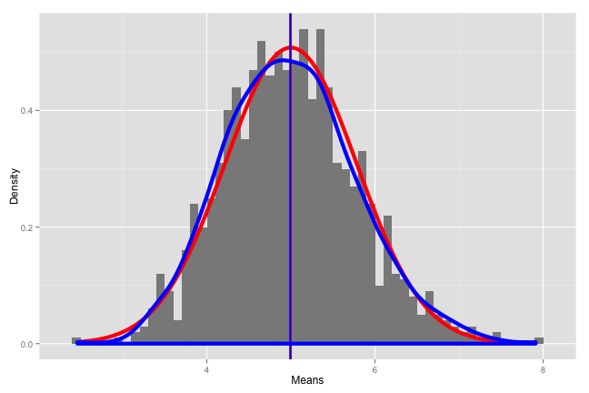
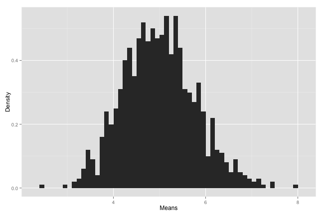
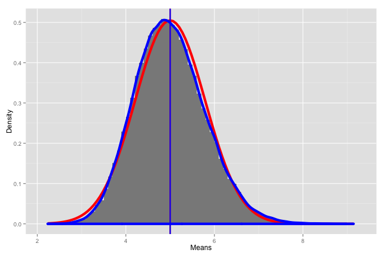

Exponential Distribution vs. Central Limit Theorem
========================================================

## Overview

In this project we will investigate the exponential distribution in R and compare it with the Central Limit Theorem. The exponential distribution can be simulated in R with rexp(n, lambda) where lambda is the rate parameter. The mean of exponential distribution is 1/lambda and the standard deviation is also 1/lambda. Set lambda = 0.2 for all of the simulations. We will investigate the distribution of averages of 40 exponentials. Note that we will need to do a thousand simulations.

We will attempt to answer the following questions:

1. Show the sample mean and compare it to the theoretical mean of the distribution.

2. Show how variable the sample is (via variance) and compare it to the theoretical variance of the distribution.

3. Show that the distribution is approximately normal.

## Simulations


```r
# we will be using ggplot2
library(ggplot2)

# set seed and calculate the means
lambda = 0.2
n = 40
nsims = 1:1000
set.seed(876)
means <- data.frame(x = sapply(nsims, function(x) {mean(rexp(n, lambda))}))
```

When we graph the means we can begin to see how the distribution appears to be normal (see Appendix Figure 1).

### Sample Mean vs. Theoretical Mean

The expected mean (or mu) of an exponential distribution of lamda is:


```r
simmu = 1 / lambda
print(simmu)
```

```
## [1] 5
```

The sample mean of our 1000 simulations of 40 random samples of exponential distributions is:


```r
simmean <- mean(means$x)
print(simmean)
```

```
## [1] 4.992
```

### Sample Variance vs. Theoretical Variance

First let's look at the expected standard deviation and its variance:


```r
simexpsd <- (1/lambda)/sqrt(n)
print(simexpsd)
```

```
## [1] 0.7906
```


```r
simexpvar <- simexpsd^2
print(simexpvar)
```

```
## [1] 0.625
```

Now let's look at the standard deviation of the simulated means and its variance:


```r
simsd <- sd(means$x)
print(simsd)
```

```
## [1] 0.7854
```


```r
simvar <- var(means$x)
print(simvar)
```

```
## [1] 0.6168
```

As one can see, the results are extremely close.

### Is the Distribution Normal?

By looking at the below graph we can see that the distribution of the simulated means (blue) approaches the normal distribution (red) and that their means (blue and red vertical lines, respectively) approach each other as well.


```r
ggplot(data = means, aes(x = x)) + 
  geom_histogram(binwidth=0.1, aes(y=..density..), fill = I('#8A8A8A'),) +
  stat_function(fun = dnorm, arg = list(mean = simmu , sd = simsd), colour = "red", size=2) + 
  geom_vline(xintercept = simmu, size=1, colour="red") + 
  geom_density(colour="blue", size=2) +
  geom_vline(xintercept = simmean, size=1, colour="blue") + 
  labs(x="Means") +
  labs(y="Density")
```

 

We can take this a step further and increase the number of simulations from 1000 to 100,000 and see that the distrubtions become even closer (see Appendix Figure 2).

<br><br><br><br><br><br>
## Appendix

### Figure 1


```r
ggplot(data = means, aes(x = x)) + 
  geom_histogram(binwidth=0.1, aes(y=..density..)) +
  labs(x="Means") +
  labs(y="Density")
```

 

### Figure 2


```r
nsims = 1:100000
set.seed(876)
means <- data.frame(x = sapply(nsims, function(x) {mean(rexp(n, lambda))}))

# recalculate
simmean <- mean(means$x)
simsd <- sd(means$x)
simmu = 1 / lambda
```


```r
ggplot(data = means, aes(x = x)) + 
  geom_histogram(binwidth=0.1, aes(y=..density..), fill = I('#8A8A8A'),) +
  stat_function(fun = dnorm, arg = list(mean = simmu , sd = simsd), colour = "red", size=2) + 
  geom_vline(xintercept = simmu, size=1, colour="red") + 
  geom_density(colour="blue", size=2) +
  geom_vline(xintercept = simmean, size=1, colour="blue") + 
  labs(x="Means") +
  labs(y="Density")
```

 
