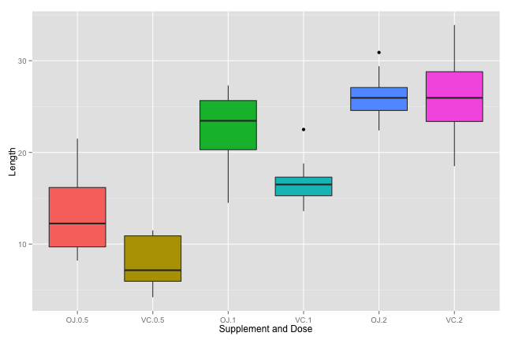

Analysis of Tooth Growth Dataset
========================================================

## Overview

In this project we will analyze the Tooth Growth Dataset included in the R package and we will attempt to achieve the following goals:

1. Load the ToothGrowth data and perform some basic exploratory data analyses.

2. Provide a basic summary of the data.

3. Use confidence intervals and/or hypothesis tests to compare tooth growth by supp and dose.

4. State conclusions and the assumptions needed for the conclusions.

### Required Libraries

For this analysis we will be using the ggplot2 library.


### Load the Dataset


```r
data(ToothGrowth)
```

### Data Description

The response is the length of odontoblasts (teeth) in each of 10 guinea pigs at each of three dose levels of Vitamin C (0.5, 1, and 2 mg) with each of two delivery methods (orange juice, OJ, or ascorbic acid, VC).

### Data Summary

Head of the dataset:


```
##    len supp dose
## 1  4.2   VC  0.5
## 2 11.5   VC  0.5
## 3  7.3   VC  0.5
## 4  5.8   VC  0.5
## 5  6.4   VC  0.5
## 6 10.0   VC  0.5
```

Summary of the dataset:


```
##       len       supp         dose     
##  Min.   : 4.2   OJ:30   Min.   :0.50  
##  1st Qu.:13.1   VC:30   1st Qu.:0.50  
##  Median :19.2           Median :1.00  
##  Mean   :18.8           Mean   :1.17  
##  3rd Qu.:25.3           3rd Qu.:2.00  
##  Max.   :33.9           Max.   :2.00
```

If we plot the data using a box plot and use the interaction function to combine the supplement and dosage columns we can see that as the dosage increases the length of tooth growth increases as well (see Appendix Code Sample 1:

 

### Initial Assumptions

The above boxplot seems to suggest that at higher dosages both orange juice and ascorbic acid increase tooth growth length comparably, but at lower dosages orange juice increases tooth growth at a higher rate than ascorbic acid.  To better understand the data and to back up what we have already seen we will now break the data down by supplement and then by dosage.  

## Analysis

### Test Data By Supplement (see Code Sample 2)


```
## Error: cannot coerce class ""htest"" to a data.frame
```

Given the p value of 0.0606 is greater than 0.05 we cannot reject the null hypothesis, therefore there is no significant tooth growth by supplement across the entire dataset.  The confidence interval [-0.171, 7.571] includes 0, which also lends toward the conclusion that there is no significant tooth growth by supplement across the entire dataset.

### Test Data By Dosage of 0.5mg By Supplement (see Code Sample 3)


```
## 
## 	Welch Two Sample t-test
## 
## data:  subset(suppoj, dose == 0.5)$len and subset(suppvc, dose == 0.5)$len
## t = 3.17, df = 14.97, p-value = 0.006359
## alternative hypothesis: true difference in means is not equal to 0
## 95 percent confidence interval:
##  1.719 8.781
## sample estimates:
## mean of x mean of y 
##     13.23      7.98
```

Given the p value of 0.006359 is lower than 0.05 we can reject the null hypothesis, therefore accepting the alternative hypothesis that at a dosage of 0.5mg orange juice results in greater tooth growth than ascorbic acid at the same dose.  The confidence interval [1.719057, 8.780943] does not include 0, which also lends toward the conclusion that there is significant tooth growth for orange juice over ascorbic acid for a dose of 0.5mg.

### Test Data By Dosage of 1.0mg By Supplement (see Code Sample 4)


```
## 
## 	Welch Two Sample t-test
## 
## data:  subset(suppoj, dose == 1)$len and subset(suppvc, dose == 1)$len
## t = 4.033, df = 15.36, p-value = 0.001038
## alternative hypothesis: true difference in means is not equal to 0
## 95 percent confidence interval:
##  2.802 9.058
## sample estimates:
## mean of x mean of y 
##     22.70     16.77
```

Given the p value of 0.001038 is lower than 0.05 we can reject the null hypothesis, therefore accepting the alternative hypothesis that at a dosage of 1.0mg orange juice results in greater tooth growth than ascorbic acid at the same dose.  The confidence interval [2.802148 9.057852] does not include 0, which also lends toward the conclusion that there is significant tooth growth for orange juice over ascorbic acid for a dose of 1.0mg.

### Test Data By Dosage of 2.0mg By Supplement (see Code Sample 5)


```
## 
## 	Welch Two Sample t-test
## 
## data:  subset(suppoj, dose == 2)$len and subset(suppvc, dose == 2)$len
## t = -0.0461, df = 14.04, p-value = 0.9639
## alternative hypothesis: true difference in means is not equal to 0
## 95 percent confidence interval:
##  -3.798  3.638
## sample estimates:
## mean of x mean of y 
##     26.06     26.14
```

Given the p value of 0.9639 is greater than 0.05 we cannot reject the null hypothesis, therefore there is no significant tooth growth by supplement for dosages of 2.0mg.  The confidence interval [-3.79807, 3.63807] includes 0, which also lends toward the conclusion that there is no significant tooth growth by supplement for dosages of 2.0mg.

### Conclusions

After plotting the data and running Two Sample t-tests by both supplement and dosage we can say with confidence that at lower dosages (0.5mg and 1.0mg) orange juice increases tooth growth over ascorbic acid, but at a dosage of 2.0mg there is no significant difference in tooth growth between orange juince and ascorbic acid.  Also, tooth growth increases using both supplements as dosages increase.

## Appendix

### Code Sample 1


```r
g <- ggplot(ToothGrowth, aes(interaction(supp, dose), len, fill=interaction(supp, dose))) + 
  geom_boxplot() +
  labs(x="Supplement and Dose") +
  labs(y="Length") +
  guides(fill=FALSE)
```

### Code Sample 2


```r
suppoj = subset(ToothGrowth, supp == "OJ")
suppvc = subset(ToothGrowth, supp == "VC")
supptest  <- t.test(suppoj$len, suppvc$len)
```

### Code Sample 3


```r
lowdosetest  <- t.test(subset(suppoj, dose == 0.5)$len, subset(suppvc, dose == 0.5)$len)
```

### Code Sample 4


```r
meddosetest  <- t.test(subset(suppoj, dose == 1.0)$len, subset(suppvc, dose == 1.0)$len)
```

### Code Sample 5


```r
highdosetest  <- t.test(subset(suppoj, dose == 2.0)$len, subset(suppvc, dose == 2.0)$len)
```
